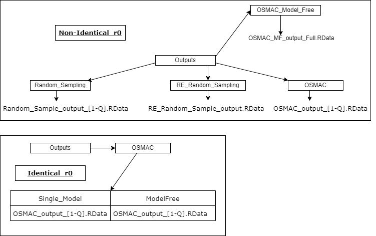
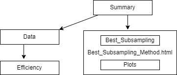

```{r setup, include=FALSE}
knitr::opts_chunk$set(echo = TRUE)
```

# 1. Overview

* The project ***"Skin Data"*** or ***"RS_OS_MROS_LR_RWS_SkinData"*** is developed for the purpose fitting multiple models estimated model parameters of the logistic regression model can be compared through the obtained informative samples from the Big Data using optimal sub-sampling and model robust optimal sub-sampling methods.

* This document aims to state every important part of this R project thoroughly in terms of folder structure related to used sub-sampling methods. 

# 2. Folder structure


* The sub-sampling methods applied in this study are 
1. Random Sampling, 
2. Rare event random sampling, 
3. Optimal Sub-sampling (OSMAC), and
4. Model Robust Optimal Sub-sampling (OSMAC_MF or OSMAC Model Free).

* A detailed description of all methods are explained in the Figure below.


* Simulations are repeated ***Replicates*** times such that at each replicate only ***Subsample_Size*** data points are extracted from the Big Data set of ***N*** observations. It is necessary to have replications so that we can evaluate the methods through MSE of the estimated model parameters.  

* The results from this simulation setup are stored in a such way that they could be summarised through Rmarkdown files for individual or grouped assessment for the above mentioned methods.

* In optimal sub-sampling and model robust optimal sub-sampling an initial sub-sample of **r0** observations are used to estimate the model parameters of a given model. From these parameters only the sub-sampling probabilities are calculated. Therefore, to compare optimal sub-sampling with model robust optimal sub-sampling there are two options; 1). Identical **r0** and 2). Non-Identical **r0**.

* Hence, **Identical_r0** can be used for method comparison and **Non_Identical_r0** can be used for application purposes.

## 2.1 Generated_Big_Data


* Generate and store Big Data.

* Using **Load_Data.R** and based on the **Q** models of the logistic regression create ***Scaled.RData***.

* In the Rscript, ***Replicates*** - number of unique simulations, ***Subsample_Size*** - target sample size, ***N*** - Big data size, ***Theta*** - Real model parameters, ***r0*** - initial sample size for optimal and model robust optimal sub-sampling.

* As of now the models are based on the covariates $x_1,x_2,x_3$ and their respective squared terms making **Q=8**.

## 2.2 Simulation_Setup


* Contains the simulation setup for the above mentioned subsampling methods based on the variety of models for the Big data and Rscripts to smoothly transfer methods and respective data.  

### 2.2.1 R_Scripts

We need to transfer two forms of data,
1. Big Data set and other information essential for the methods.
2. Functions for the sub-sampling methods.

* Here we develop the functions and transfer them safely to the simulation setup.

#### 2.2.1.1 Setup_Data.R

* Data stored in **Generate_Big_Data** is transferred to **Analysis**.

#### 2.2.1.2 Random_Sampling_Setup.R

* A setup for random sampling such that model parameters are estimated at each simulation and are applied for the big data. 

#### 2.2.1.3 RE Random_Sampling_Setup.R

* A setup for rare event random sampling such that model parameters are estimated at each simulation and are applied for the big data. 

#### 2.2.1.4 OSMAC_Algorithm.R and OSMAC_Setup.R [Identical r0]

* The optimal sub-sampling, model robust optimal sub-sampling and a setup to apply these methods such that model parameters are estimated at each simulation and are applied for the big data.

#### 2.2.1.5 OSMAC_Algorithm.R and OSMAC_Setup.R [Non Identical r0]

* The optimal sub-sampling and a setup to apply these methods such that model parameters are estimated at each simulation and are applied for the big data.

#### 2.2.1.6 OSMAC_Algorithm_Model_Free.R and OSMAC_Model_Free_Setup.R [Non_Identical_r0]

* The model robust optimal sub-sampling and a setup to apply these methods such that model parameters are estimated at each simulation and are applied for the big data.

## 2.2.2 Analysis

Each model related covariate data is separately used on each subsampling method individually.

#### 2.2.2.1 Random Sampling

* **Init.RData** - data file containing the big data and initial information regarding the simulation.
* **Run_RandomSample.RData** - Random sampling function for **Replicates**.
* **Simulation_Results_Random_Sampling.R** - R script to run the random sampling method over **Replicates** on the **Init.RData** from **Run_RandomSample.RData**.
* **Results** - Results of the simulation are stored here according to each model as an Rdata file **Random_Sample_output_i.RData**, where **i=[1-Q]**. 

#### 2.2.2.2 RE Random Sampling

* **Init.RData** - data file containing the big data and initial information regarding the simulation.
* **RE_RandomSample.RData** - RE Random sampling function for **Replicates**.
* **Simulation_Results_RE_Random_Sampling.R** - R script to run the rare event random sampling method over **Replicates** on the **Init.RData** from **RE_RandomSample.RData**.
* **Results** - Results of the simulation are stored here according to each model as an Rdata file **RE_Random_Sample_output_i.RData**, where **i=[1-Q]**.

#### 2.2.2.3 OSMAC [Non Identical r0]

* **Init.RData** - data file containing the big data and initial information regarding the simulation.
* **Run_OSMAC.RData** - Optimal sampling function for **Replicates**.
* **Simulation_Results_OSMAC_Sampling.R** - R script to run the optimal sampling method over **Replicates** on the **Init.RData** from **Run_OSMAC.RData**.
* **Results** - Results of the simulation are stored here according to each model as an Rdata file **OSMAC_output_i.RData**, where **i=[1-Q]**.  

#### 2.2.2.4 OSMAC Model Free [Non Identical r0]

* **Init.RData** - data file containing the big data and initial information regarding the simulation.
* **Run_OSMAC.RData** - model robust optimal sampling function for **Replicates**.
* **Simulation_Results_OSMAC_Sampling.R** - R script to run the model robust optimal sampling method over **Replicates** on the **Init.RData** from **Run_OSMAC.RData**.
* **Results** - Results of the simulation are stored here as a single Rdata file **OSMAC_MF_output_Full.RData**.

#### 2.2.2.5 OSMAC [Identical r0]

* **Init.RData** - data file containing the big data and initial information regarding the simulation.
* **Run_OSMAC.RData** - optimal sampling and model robust optimal sampling function for **Replicates**.
* **Simulation_Results_OSMAC_Sampling.R** - R script to run the optimal sampling and model robust optimal sampling methods over **Replicates** on the **Init.RData** from **Run_OSMAC.RData**.
* **Results** - Results of the simulation are stored here according to optimal sub-sampling in **Single_Model**, model robust optimal sub-sampling **ModelFree**, where each model output is named as **OSMAC_output_[i].RData** for **i=[1-Q]**.

## 2.3 Outputs

* While in the **Simulation_Setup** results are stored for analysis purposes, the same results are stored here. 



## 2.4 Rmarkdown


* Rmarkdown files are used to individually assess the sub-sampling methods through plots for estimated model parameters. 

* **RE_and_Random_Sampling_and_OSMAC.R** - R script to summarise the results from the sub-sampling methods through the Rmarkdown files **Random_Sampling.Rmd**, **RE_Random_Sampling.Rmd**, **OSMAC_Method.Rmd** and **OSMAC_Model_Free_Method.Rmd**.

* **OSMAC_Command.R** - R script to summarise the results from the optimal sub-sampling and model robust optimal sampling methods through the Rmarkdown file **OSMAC_Method.Rmd**.

* **Summary_Rmarkdown.R** in the **Rmarkdown/Summary** folder compares the sub-sampling methods through Mean Squared Error through the **Best_Subsampling_Method.Rmd**.

## 2.5 htmloutputs


* Here, summaries from the Rmarkdown files **Random_Sampling.Rmd**, **RE_Random_Sampling.Rmd**, **OSMAC_Method.Rmd**(for Identical and Non Identical r0) and **OSMAC_Model_Free_Method.Rmd** (for Non Identical r0) are stored as html files.


## 2.6 Summary



* Here, summaries from the Rmarkdown files **Best_Subsampling_Method.Rmd** are stored as html files. 

### 2.6.1 Summary/Data/Efficiency

* When running the Rmarkdown files **Random_Sampling.Rmd**, **RE_Random_Sampling.Rmd**, **OSMAC_Method.Rmd** and **OSMAC_Model_Free_Method.Rmd** summary data (MSE) are stored here.

* Using these data files only summarising through the files in **Rmarkdown/Summary** occurs.

## 2.7 Articles.Rmd, Publication.Rmd and Publication_Ready_Command.R

* Use **Publication_Ready_command.R** to run **Publication.Rmd** on every model and its respective big data.

* Use **Articles.Rmd** to generate plots relevant to the paper as pdf file **Article_Plots/RWA_LR_SkinData.pdf**. 
