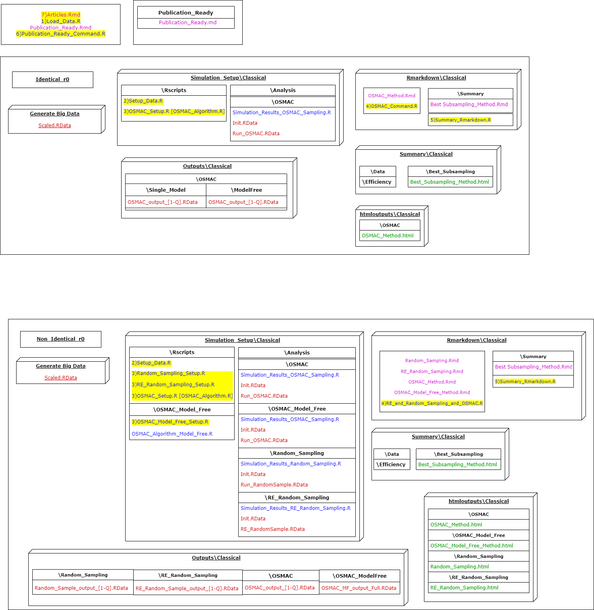

# RS_OS_MROS_LR_RWS_SkinData

### ### Random Sampling vs Optimal Sub-sampling vs Model Robust Optimal Sub-sampling method for the Logistic Regression problems on Real World Subsampling methods 

<!-- badges: start -->
<!-- badges: end -->

Skin_Data Rproject is a simulation framework to implement the newly introduced model free approach for the OSMAC sub-sampling method over the Skin Segmentation Data for the logistic regression model.

The main effects model includes two variables and rest of the models include every possible combination of the covariates squared term including the intercept.

## Brief summary of how to run the setup

Run files from 3 to 7 to obtain the results as in the paper.

1. Load_Data.R
2. Setup_Data.R
3. OSMAC_Setup.R [Identical_r0]; Random_Sampling.R, RE_Random_Sampling_Setup.R, OSMAC_Setup.R and OSMAC_Model_Free_Setup.R [Non_Identical_r0]
4. OSMAC_Command.R [Identical_r0]; RE_and_Random_Sampling_and_OSMAC.R [Non_Identical_r0]
5. Summary_Rmarkdown.R
6. Publication_Ready_Command.R
7. Articles.Rmd

For a complete understanding of the Rproject setup refer Manual.md or Manual.html

* To ensure replicability the R package **renv** is used to maintain the package versions in this Rproject.
